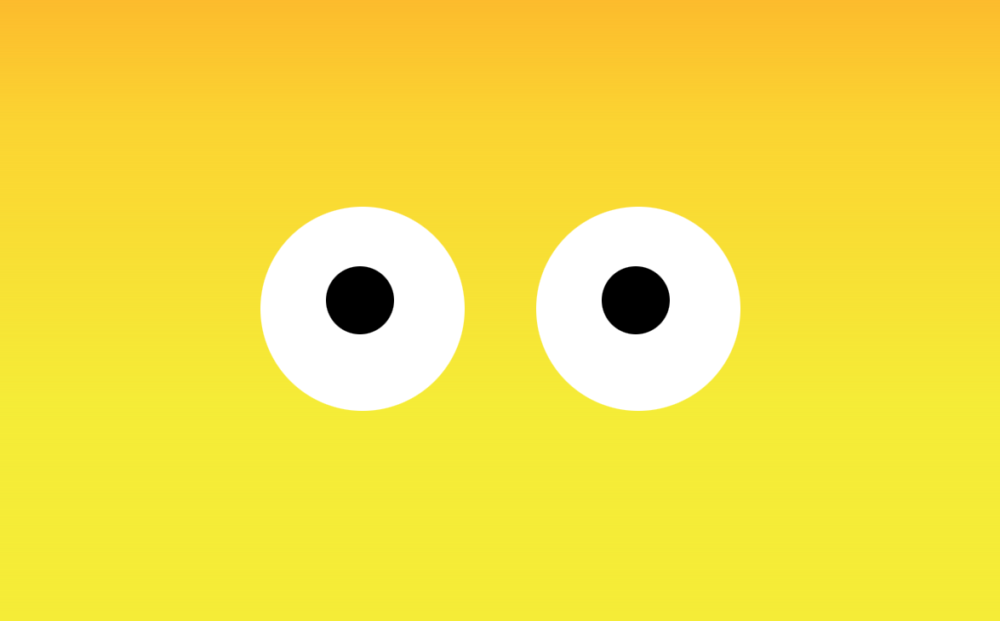

# Moving Eyes
## Exercise on Eyes Tracking Cursor

## Description
In order to create eyes on a webpage, HTML tags were used to manipulate the appearance in the DOM. From there, introductory CSS was used to style the page. Lastly, in the JavaScript file, a handle on the ID "ball" was used in order to add functionality to the eyes. 
## Installation 
Download a copy of the Eyes-Tracking-Cursor repo. Drag and drop "eyes.html" onto a blank webpage and load the page. You should see two eyes interacting with your cursor!

## Usage
This project is an example of having an interactive element on a webpage. It can also show new coders how to separate and organize their files. In "eyes.html", two other files are linked, the CSS and Javascript. This is the preferred level of organization over the "TwoEyeComboFile" which combines HTML, CSS, and JavaScript into one file. 

## Support
[MDN Web Docs](https://developer.mozilla.org/en-US/docs/Web/JavaScript)

## Roadmap
My goal for this project is to continue learning how to make more interactive elements on a page. Eyebrows and arms will be added to the character and can be manipulated using a cursor.
## License Information
MIT
